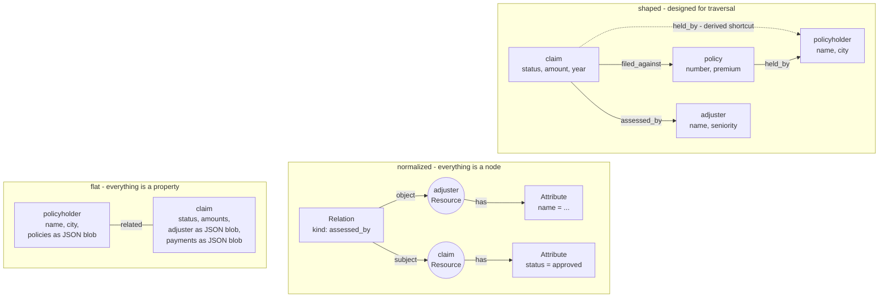

```mermaid
flowchart LR
    subgraph FLAT["flat - everything is a property"]
        direction TB
        F1["policyholder<br/>name, city,<br/>policies as JSON blob"]
        F2["claim<br/>status, amounts,<br/>adjuster as JSON blob,<br/>payments as JSON blob"]
        F1 ---|related| F2
    end

    subgraph NORM["normalized - everything is a node"]
        direction TB
        N2["Relation<br/>kind: assessed_by"]
        N1(("claim<br/>Resource"))
        N3(("adjuster<br/>Resource"))
        N4["Attribute<br/>status = approved"]
        N5["Attribute<br/>name = ..."]
        N1 -->|has| N4
        N2 -->|subject| N1
        N2 -->|object| N3
        N3 -->|has| N5
    end

    subgraph SHAPED["shaped - designed for traversal"]
        direction TB
        S1["claim<br/>status, amount, year"]
        S2["adjuster<br/>name, seniority"]
        S4["policy<br/>number, premium"]
        S3["policyholder<br/>name, city"]
        S1 -->|assessed_by| S2
        S1 -->|filed_against| S4
        S4 -->|held_by| S3
        S1 -.->|held_by - derived shortcut| S3
    end

    F2 ~~~ N2
    N3 ~~~ S1
```
