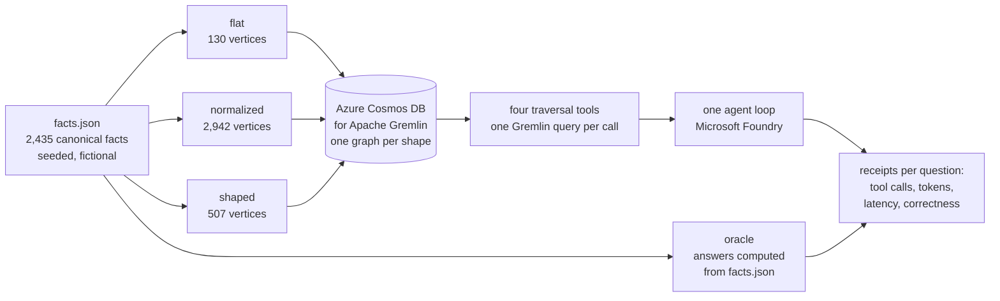

```mermaid
flowchart LR
    FACTS["facts.json<br/>2,435 canonical facts<br/>seeded, fictional"]
    FLAT["flat<br/>130 vertices"]
    NORM["normalized<br/>2,942 vertices"]
    SHAPED["shaped<br/>507 vertices"]
    COSMOS[("Azure Cosmos DB<br/>for Apache Gremlin<br/>one graph per shape")]
    TOOLS["four traversal tools<br/>one Gremlin query per call"]
    AGENT["one agent loop<br/>Microsoft Foundry"]
    ORACLE["oracle<br/>answers computed<br/>from facts.json"]
    VERDICT["receipts per question:<br/>tool calls, tokens,<br/>latency, correctness"]

    FACTS --> FLAT
    FACTS --> NORM
    FACTS --> SHAPED
    FACTS --> ORACLE
    FLAT --> COSMOS
    NORM --> COSMOS
    SHAPED --> COSMOS
    COSMOS --> TOOLS
    TOOLS --> AGENT
    AGENT --> VERDICT
    ORACLE --> VERDICT
```
